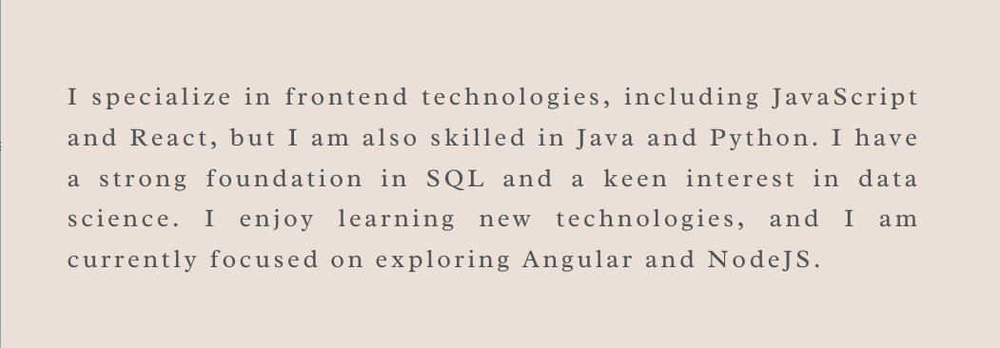

Github Stats
---

Projects
---

Skills
---

[![Java-Spring][Spring]][Spring-url] [![Spring-Boot][SpringBoot]][SpringBoot-url] [![Hibernate][hibernate]][hibernate-url] [![Postgres][PostgreSQL]][postgres-url] [![React][React.js]][React-url] [![Bootstrap][Bootstrap.com]][Bootstrap-url] [![Angular][angular-img]][angular-url] [![JavaScript][javascript-img]][javascript-url] [![Python][python-img]][python-url] [![Java][java-img]][java-url]  [![HTML][html-img]][html-url] [![CSS][css-img]][css-url] [![Tailwind][Tailwind]][Tailwind-url] [![PostgreSQL][PostgreSQL]][PostgreSQL-url] [![Bootstrap][Bootstrap]][Bootstrap-url] [![Sass][sass-img]][sass-url] [![SCSS][scss-img]][scss-url]

[![LinkedIn][linkedin-img]][linkedin-url]

[sass-img]: https://img.shields.io/badge/Sass-CC6699?style=for-the-badge&logo=sass&logoColor=white
[sass-url]: https://sass-lang.com/

[scss-img]: https://img.shields.io/badge/SCSS-CC6699?style=for-the-badge&logo=sass&logoColor=white
[scss-url]: https://sass-lang.com/documentation/syntax#scss

[Tailwind]: https://img.shields.io/badge/Tailwind-38B2AC?style=for-the-badge&logo=tailwind-css&logoColor=white
[Tailwind-url]: https://tailwindcss.com/

[PostgreSQL]: https://img.shields.io/badge/PostgreSQL-336791?style=for-the-badge&logo=postgresql&logoColor=white
[PostgreSQL-url]: https://www.postgresql.org/

[Bootstrap]: https://img.shields.io/badge/Bootstrap-563D7C?style=for-the-badge&logo=bootstrap&logoColor=white
[Bootstrap-url]: https://getbootstrap.com/

[css-img]: https://img.shields.io/badge/-CSS-1572B6?style=for-the-badge&logo=css3
[css-url]: https://developer.mozilla.org/en-US/docs/Web/CSS

[html-img]: https://img.shields.io/badge/HTML5-E34F26?style=for-the-badge&logo=html5&logoColor=white
[html-url]: https://en.wikipedia.org/wiki/HTML

 
[java-img]: https://img.shields.io/badge/Java-ED8B00?style=for-the-badge&logo=java&logoColor=white
[java-url]: https://www.java.com/

[python-img]: https://img.shields.io/badge/Python-3776AB?style=for-the-badge&logo=python&logoColor=white
[python-url]: https://www.python.org/

[javascript-img]: https://img.shields.io/badge/-JavaScript-F7DF1E?style=for-the-badge&logo=javascript&logoColor=black
[javascript-url]: https://www.javascript.com/

[linkedin-img]: https://img.shields.io/badge/-LinkedIn-blue?style=for-the-badge&logo=linkedin&logoColor=white
[linkedin-url]: https://www.linkedin.com/in/your-username/

[React.js]: https://img.shields.io/badge/React-20232A?style=for-the-badge&logo=react&logoColor=61DAFB
[React-url]: https://reactjs.org/

[Spring]: https://img.shields.io/badge/Spring-6DB33F?style=for-the-badge&logo=spring&logoColor=white
[Spring-url]: https://spring.io
[Java]: 	https://img.shields.io/badge/Java-ED8B00?style=for-the-badge&logo=java&logoColor=white

[Bootstrap.com]: https://img.shields.io/badge/Bootstrap-563D7C?style=for-the-badge&logo=bootstrap&logoColor=white
[Bootstrap-url]: https://getbootstrap.com

[SpringBoot]: https://img.shields.io/badge/Spring_Boot-6DB33F?style=for-the-badge&logo=springboot&logoColor=white
[SpringBoot-url]: https://spring.io/projects/spring-boot

[PostgreSQL]: https://img.shields.io/badge/Postgresql-20232A?style=for-the-badge&logo=postgresql
[postgres-url]:https://postgresql.org

[hibernate]: https://img.shields.io/badge/Hibernate-20232A?style=for-the-badge&logo=hibernate&logoColor=61DAFB
[hibernate-url]: https://hibernate.org

[angular-img]: https://img.shields.io/badge/-Angular-DD0031?style=for-the-badge&logo=angular&logoColor=white
[angular-url]: https://angular.io/

